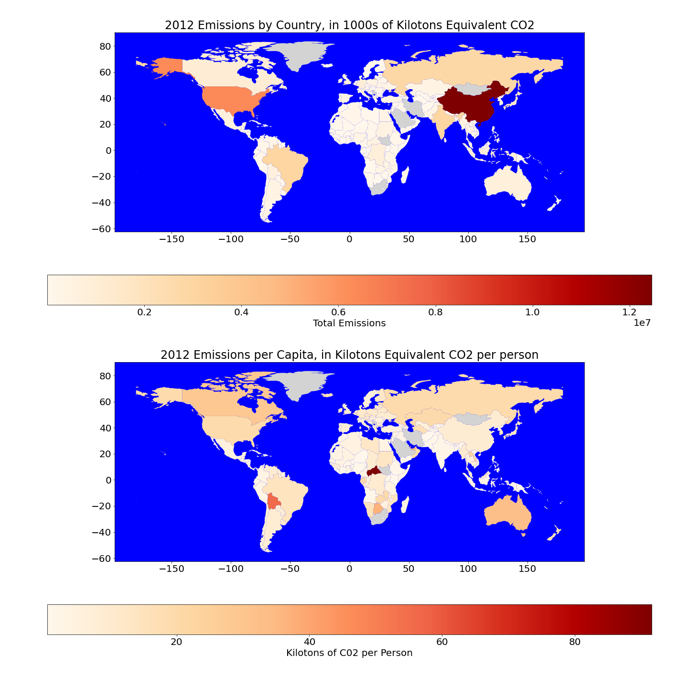

# geopandas_demonstration
A demonstration of Geopandas

Check out this notebook to see a starter project in GeoPandas using World Bank Indicator data to make a cholorpleth map of carbon emissions by country.

Sources: 

https://geopandas.readthedocs.io/en/latest/docs/user_guide/mapping.html

J. D. Hunter, "Matplotlib: A 2D Graphics Environment", Computing in Science & Engineering, vol. 9, no. 3, pp. 90–95, 2007.
